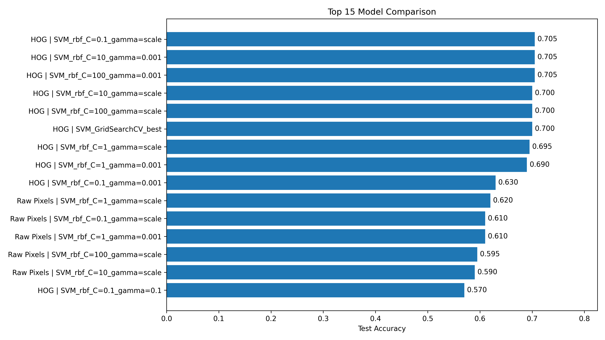
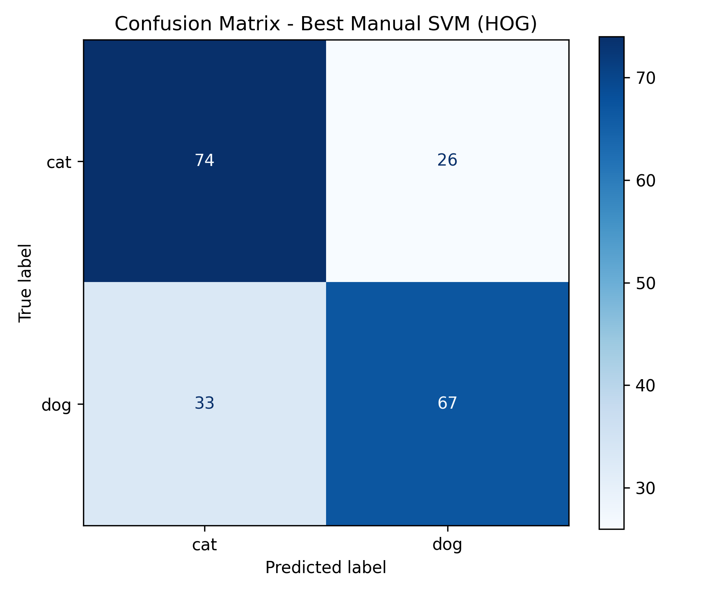

# SVM Cat-Dog Classification

A classical machine learning project for binary cat and dog image classification using SVM and HOG features.



This project implements binary image classification for cats and dogs using Support Vector Machine (SVM). The project compares Raw Pixels and HOG features, tests different SVM kernels and hyperparameters, runs GridSearchCV, and compares SVM with Logistic Regression and KNN.

## Key Results

- Best feature representation: HOG
- Best model: SVM with RBF kernel
- Test accuracy: 70.5%
- F1-score: 0.694

## Confusion Matrix



## Dataset

The dataset is not included in this repository. Download it from the link below and place it in the required directory structure.

Dataset link:
https://www.kaggle.com/datasets/aleemaparakatta/cats-and-dogs-mini-dataset?resource=download

To run the project, download the Cats-And-Dogs-Mini-Dataset from the link above and place the images in the following structure:

```text
data/
└── raw/
    ├── cat/
    └── dog/
```

The `cat` folder should contain cat images and the `dog` folder should contain dog images.

In the executed version of this project, the dataset contained:

```text
cat: 500 images
dog: 500 images
total: 1000 images
```


## Project Structure

```text
cat-dog-svm-classifier/
├── src/
│   ├── config.py
│   ├── data_loader.py
│   ├── evaluate.py
│   ├── features.py
│   ├── train.py
│   ├── utils.py
│   └── visualization.py
├── outputs/
│   ├── figures/
│   ├── results/
│   └── models/
├── main.py
├── requirements.txt
├── README.md
└── report.pdf
```

## Installation

Install the required Python libraries:

```bash
pip install -r requirements.txt
```

## Run the Project

After placing the dataset in the correct path, run:

```bash
python main.py
```

The program will collect image paths, preprocess images, extract Raw Pixel and HOG features, train models, evaluate them, and save the outputs.

## Outputs

After execution, the main outputs are saved in:

```text
outputs/figures/
outputs/results/
outputs/models/
```

Important output files include:

```text
outputs/results/final_model_comparison.csv
outputs/results/grid_search_results.csv
outputs/figures/class_distribution.png
outputs/figures/model_comparison_top15.png
outputs/figures/confusion_matrix_best_manual_hog_svm_rbf_c_0_1_gamma_scale.png
outputs/figures/misclassified_examples_best_manual_svm.png
```

## Best Model

The final selected model is:

```text
Feature Type: HOG
Model: SVM
Kernel: RBF
C: 0.1
gamma: scale
Test Accuracy: 0.705
F1-score: 0.69430
Overfitting Gap: 0.13375
```

## Notes

The `data/` folder is not included in the submitted zip file.
The `outputs/features/` folder is also not required in the final submission because feature files are generated again when running `main.py`.
